## What about the app?

The app is the blackbox testing to test AIQUA SDK integration. It uses Kotlin Multiplatform technology (KMP)
So the core logic can be shared across iOS & Android including the AIQUA's installation, event logging, etc. However, the UI stays native with Compose (Android) and SwiftUI (iOS) to be closer to the UI for each platform. 

The architecture of the app is documented at [docs/architecture.md](./docs/architecture.md) and for how data flows through the app, and [docs/adr](./docs/adr) for key decisions for all technical decisions in building the app.

### AIQUA events

These are the events the app sends to AIQUA. Both apps send the same events from the shared ViewModels (`sharedLogic`),
so Android and iOS always match. Every 5th Order fails on purpose, so `checkout_failed` is easy to trigger.

| Event | Parameters | Sent when |
|---|---|---|
| `screen_viewed` | `screen_name`: `home` / `cart` | A screen appears: app launch or a tab switch. On Android, rotating the screen sends it again. |
| `product_purchased` | `order_id`, `product_id`, `product_name`, `category`, `price` (one unit, yen), `quantity` | An Order was placed: one event per item, before `checkout_completed`. No value. |
| `checkout_completed` | `order_id`, `product_count`, **valueToSum** = Order total, **valueToSumCurrency** = `JPY` (hardcoded as JPY for now :P) | An Order was placed. The only event with a value, so revenue is counted once. |
| `checkout_failed` | `reason` (the error message) | Placing an Order failed. No value and no per-item events. |

Events sharing an `order_id` belong to the same Order. To see them, open the AIQUA dashboard, then Settings >
Recent activity (Android / iOS tabs); they can take a few minutes to appear. How events are wired is in
[docs/architecture.md](./docs/architecture.md#events).

### Screenshots

Native Android and iOS screens, captured from the running apps.

| Android | iOS |
| --- | --- |
| 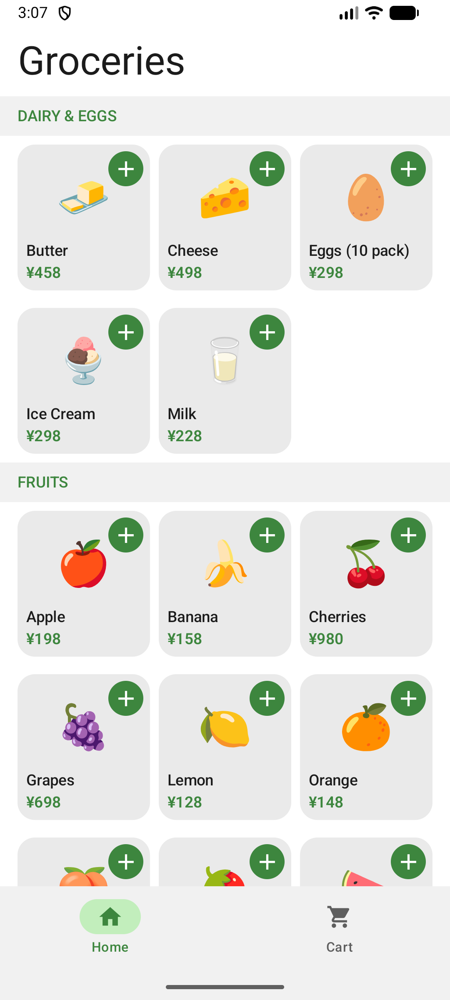 | 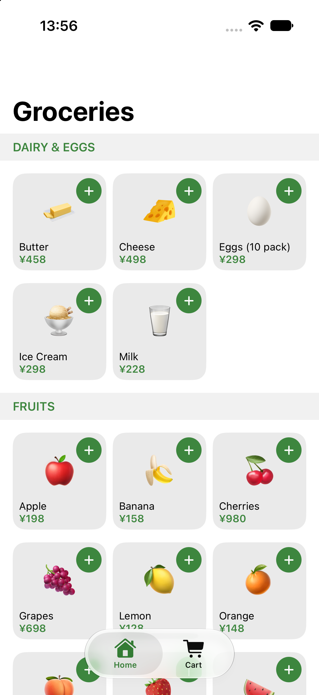 |

#### Home

Browse grouped products, add items, and adjust quantities without leaving the catalog.

| State | Android | iOS |
| --- | --- | --- |
| Product catalog |  |  |
| Selected products and quantities | 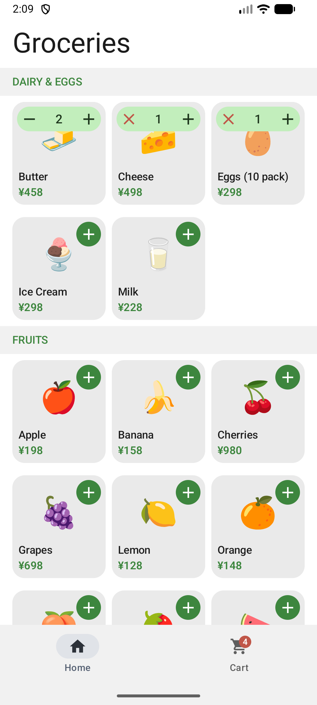 | 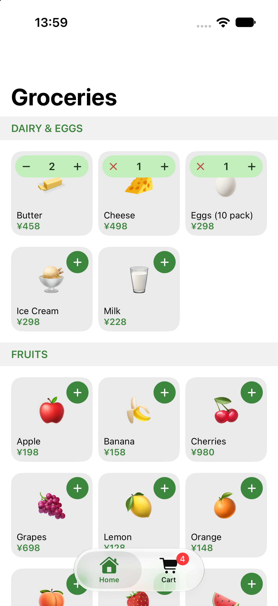 |

#### Cart

The empty state links back to shopping. A filled cart shows line totals, quantity controls,
the order total, and the Buy action.

| State | Android | iOS |
| --- | --- | --- |
| Empty cart | 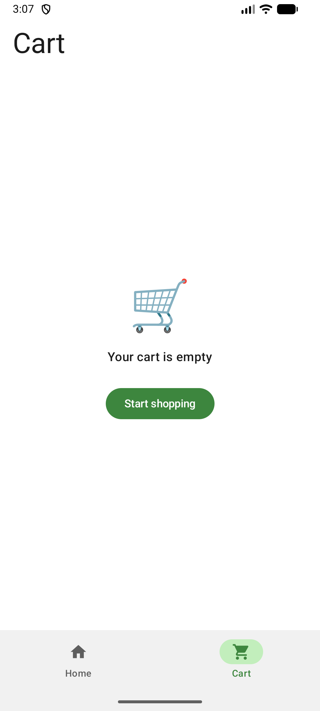 | 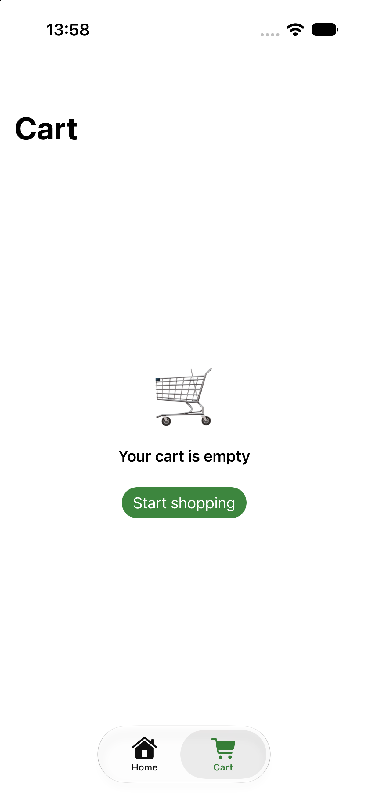 |
| Filled cart | 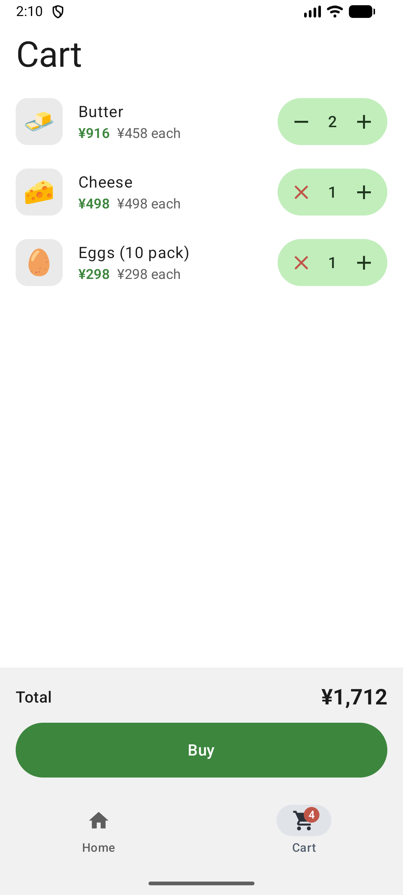 | 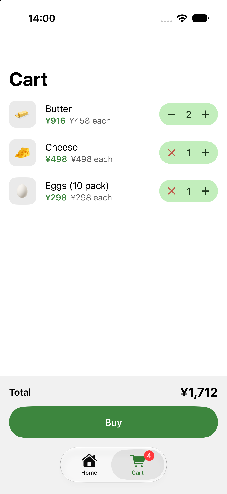 |

#### Checkout

Checkout blocks further interaction while placing an order. Success clears the cart;
failure preserves its contents so the user can try again.

| State | Android | iOS |
| --- | --- | --- |
| Placing an order | 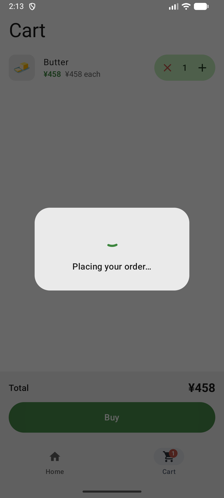 | 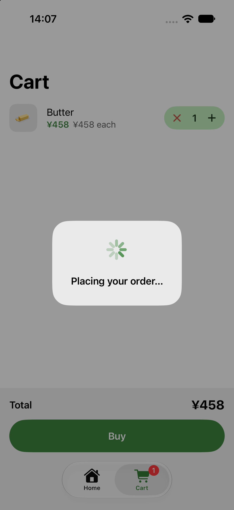 |
| Order placed | 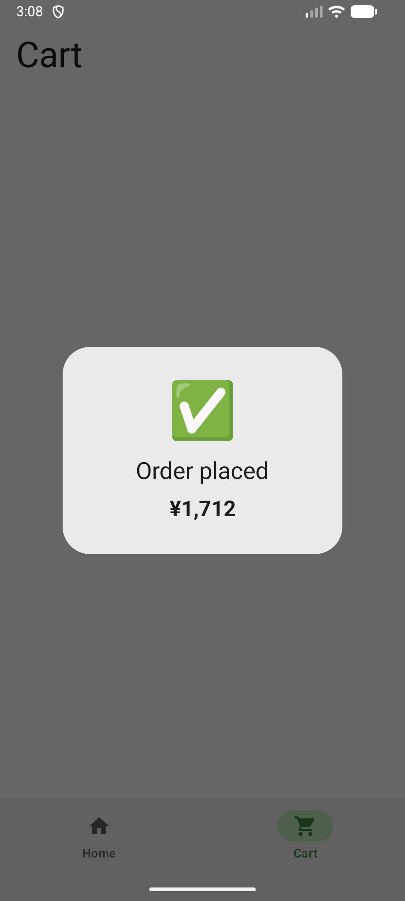 | 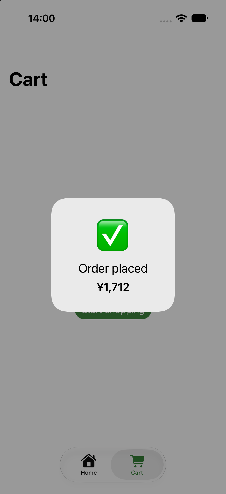 |
| Order failed | 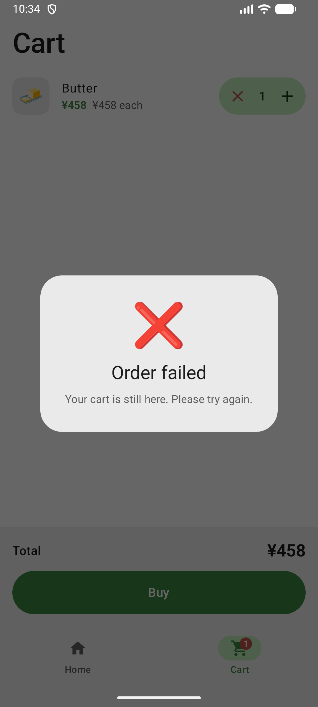 | 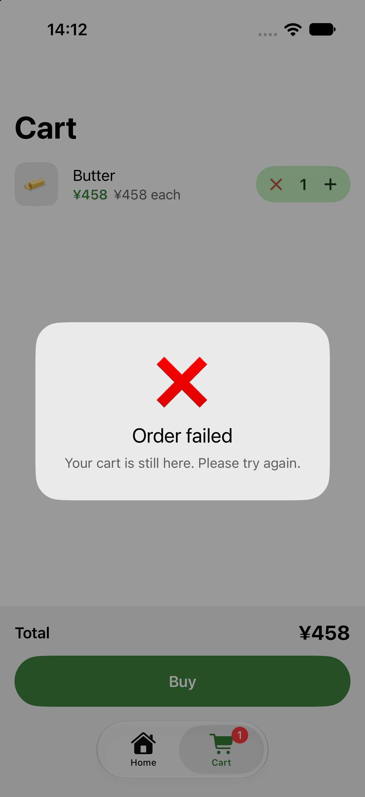 |

### Running the apps

Use the run configurations provided by the run widget in your IDE's toolbar. You can also use these commands and options:

- Android app: `./gradlew :androidApp:assembleDebug`
- iOS app: open the [/iosApp](./iosApp) directory in Xcode and run it from there.

---

Learn more about [Kotlin Multiplatform](https://www.jetbrains.com/help/kotlin-multiplatform-dev/get-started.html)…
